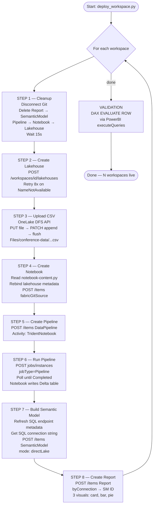
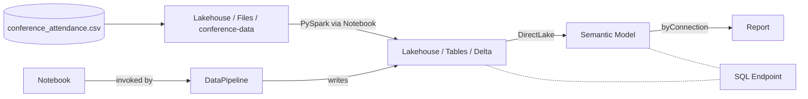

# Fabric Pipeline Automation — Architecture & Approach Notes

## End-to-End Deployment Flow

The script `scripts/deploy_workspace.py` runs this 8-step flow against each Fabric
workspace listed in `config/workspace-config.yaml`:



## Resulting Artifacts (per workspace)



## Approaches Tested — Pros & Cons

During development, multiple approaches were attempted before settling on the
final one. This is a compressed log of what worked and what didn't.

### A. Power BI Desktop publish (`.pbix` file)

| Pros | Cons |
|---|---|
| Familiar GUI authoring | **Not automatable** — requires desktop app |
| Rich visual editor | Cannot be deployed via API end-to-end |
| | DirectLake binding cannot be re-pointed via API after publish |

**Verdict:** Rejected — not headless.

---

### B. GitOps via Fabric Git Integration

| Pros | Cons |
|---|---|
| Declarative source-of-truth | Requires interactive GitHub OAuth (one per workspace) |
| Auto-sync on commit | Sync delays (30–60s) and silent merge conflicts |
| Easy rollback via Git | Difficult to debug; "Sync" UX hides errors |
| | Notebook metadata (lakehouse binding) is region-specific → causes drift |
| | Requires Fabric tenant admin to enable |

**Verdict:** Tested — abandoned because OAuth couldn't be automated and sync
issues made deployments non-deterministic.

---

### C. Pipeline `copyActivity` (Blob → Lakehouse)

| Pros | Cons |
|---|---|
| Native pipeline activity | Required pre-existing **Connection** resource (cannot be created via public API in some tenants) |
| No notebook code to maintain | Authentication hand-off between blob + lakehouse is fragile |
| | Schema mapping must be hard-coded |

**Verdict:** Tested — abandoned because Connection management is not fully
automatable in the tenant.

---

### D. Notebook-only (no pipeline)

| Pros | Cons |
|---|---|
| Simpler — fewer artifacts | No scheduling without an extra trigger artifact |
| Direct PySpark control | Cannot re-run from outside without `notebooks/runOnDemand` API which has limited support |

**Verdict:** Works but less production-realistic. Kept Pipeline wrapper because
`POST /jobs/instances?jobType=Pipeline` is **fully API-supported** and gives a
clean re-run surface.

---

### E. ✅ FINAL: API-only orchestration (Pipeline → Notebook → Delta → DirectLake)

| Pros | Cons |
|---|---|
| Fully headless — uses only `az` CLI tokens | Requires understanding of multiple API surfaces (Fabric REST, OneLake DFS, Power BI XMLA) |
| Deterministic, idempotent (with cleanup phase) | Schema-less SQL endpoint means tables appear under `dbo` schema only after `refreshMetadata` |
| `jobType=Pipeline` re-run trigger works perfectly | TMDL semantic model authoring is verbose |
| DirectLake = no refresh needed; data flows live | `ItemDisplayNameNotAvailableYet` after delete requires retry loop |
| Cross-region uniform (single script handles N workspaces) | Notebook metadata must be regex-rebound to new lakehouse ID per region |

**Verdict:** Adopted. Single Python script reproduces the full stack end-to-end
in ~3–4 minutes per workspace.

## Key Lessons Learned

1. **Always verify uploads with `getDefinition` after `updateDefinition`.** A
   200 OK can hide a 0-byte payload (encountered with the empty-notebook bug).
2. **Use `format=fabricGitSource` + `notebook-content.py`** for notebook content
   rather than `format=ipynb`. It's smaller, diffable, and the Fabric backend
   converts it transparently.
3. **The pipeline run trigger** `POST /workspaces/{ws}/items/{pipelineId}/jobs/instances?jobType=Pipeline`
   *is* publicly supported despite being undocumented in some places. Returns
   202 + `Location` header with job-instance URL for polling.
4. **DirectLake semantic model needs `expressionSource: "DatabaseQuery"` and a
   matching M expression** referencing `Sql.Database(connectionString, lakehouseName)`.
   Without this, the model creates but throws `ProcessFull` errors when queried.
5. **Always call `refreshMetadata` on the SQL endpoint** after the first
   notebook run to make new Delta tables visible to Power BI.
6. **Delete order matters**: Report → SemanticModel → Pipeline → Notebook →
   Lakehouse (because of dependency tracking).
7. **Name reuse after delete** triggers `ItemDisplayNameNotAvailableYet` for
   30–120s. Implement retry with backoff.

## API Surface Used

| API | Purpose |
|---|---|
| `POST /workspaces/{ws}/lakehouses` | Create lakehouse |
| `PUT/PATCH onelake.dfs.fabric.microsoft.com/...` | Upload files via DFS Gen2 |
| `POST /workspaces/{ws}/items` | Create Notebook, Pipeline, SemanticModel, Report |
| `POST /workspaces/{ws}/items/{id}/updateDefinition` | Update item content |
| `POST /workspaces/{ws}/items/{id}/jobs/instances?jobType=Pipeline` | Trigger pipeline run |
| `GET /workspaces/{ws}/items/{id}/jobs/instances/{jobId}` | Poll job status |
| `POST /workspaces/{ws}/sqlEndpoints/{id}/refreshMetadata?preview=true` | Sync SQL endpoint |
| `POST api.powerbi.com/.../datasets/{id}/executeQueries` | Run DAX validation |
| `PATCH /workspaces/{ws}` | Rename workspace |
| `POST /workspaces/{ws}/git/disconnect` | Disconnect Git integration |

## Token Resources Required

```
https://api.fabric.microsoft.com         # Fabric REST API
https://storage.azure.com                # OneLake DFS API
https://analysis.windows.net/powerbi/api # DAX validation queries
```

All obtained via `az account get-access-token --resource <resource>` —
no service principal or client secrets required.
